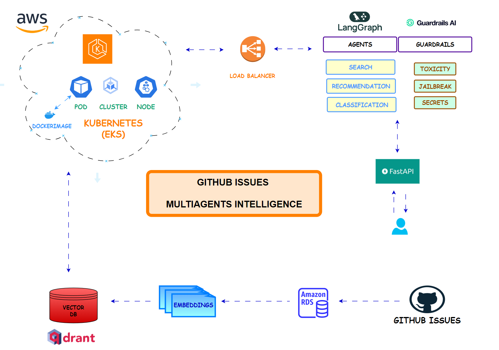

# GitHub Issues Multiagents Intelligence

<div align="center">
    
</div>

<div align="center">
    <a href="https://www.python.org/downloads/release/python-3120/"></a>
    <a href="https://github.com/astral-sh/uv"></a>
    <a href="https://www.langchain.com/langgraph"></a>
    <a href="https://qdrant.tech/"></a>
    <a href="https://www.guardrailsai.com/"></a>
    <a href="https://fastapi.tiangolo.com/"></a>
    <a href="https://pydantic.dev/"></a>
</div>
<div align="center">
    <a href="https://github.com/features/actions"></a>
    <a href="http://mypy-lang.org/"></a>
    <a href="https://github.com/astral-sh/ruff"></a>
    <a href="https://docs.pytest.org/"></a>
    <a href="https://github.com/pre-commit/pre-commit"></a>
    <a href="LICENSE"></a>
</div>
<p align="center">
    <em>A modular pipeline for searching and analyzing GitHub issues and providing recommendations for issues classification</em>
</p>

______________________________________________________________________

This project provides an intelligent, multi-agent system for processing, analyzing, and managing GitHub issues at scale. It leverages LLMs, vector databases, and cloud-native kubernetes infrastructure to automate search, triage, and enrichment of GitHub issues, supporting advanced workflows and integration using LangGraph agents.

## Overview

- Multi-agent orchestration for issue processing
- Integration with GitHub, PostgreSQL, and Qdrant vector store
- Modular architecture for agents, guardrails, tools, and pipelines
- Infrastructure-as-code with AWS CDK and Kubernetes support

## Table of Contents

- [GitHub Issues Multiagents Intelligence](#github-issues-multiagents-intelligence)
  - [Overview](#overview)
  - [Table of Contents](#table-of-contents)
  - [Project Structure](#project-structure)
  - [Prerequisites](#prerequisites)
  - [Installation](#installation)
    - [Clone the repository](#clone-the-repository)
    - [Configure Environment](#configure-environment)
    - [Copy and configure environment variables](#copy-and-configure-environment-variables)
  - [Usage](#usage)
    - [Configuration](#configuration)
    - [Makefile](#makefile)
    - [PostgreSQL](#postgresql)
      - [Alembic Migrations](#alembic-migrations)
      - [Guardrails](#guardrails)
    - [AWS CDK](#aws-cdk)
    - [Testing](#testing)
  - [API](#api)
  - [Kubernetes](#kubernetes)
    - [Cluster Configuration](#cluster-configuration)
    - [Secrets and Configmap](#secrets-and-configmap)
    - [Production Docker Image](#production-docker-image)
  - [License](#license)

## Project Structure

<div align="center">
    
</div>

```text
├── LICENSE
├── Makefile
├── README.md
├── alembic.ini
├── aws_cdk_infra
│   ├── README.md
│   ├── app.py
│   ├── aws_eks_rds
│   │   ├── __init__.py
│   │   ├── eks_stack.py
│   │   ├── rds_stack.py
│   │   └── vpc_stack.py
│   ├── requirements.txt
│   └── source.bat
├── docker
│   ├── dev.Dockerfile
│   ├── docker-compose.yml
│   └── prod.Dockerfile
├── env.example
├── kubernetes
│   ├── fastapi-deployment.yaml
│   ├── fastapi-service.yaml
│   ├── iam_policy.json
│   └── test-pod.yaml
├── langgraph.json
├── migrations
│   ├── README
│   ├── env.py
│   ├── script.py.mako
│   └── versions
│       └── 77e4d0a13aa8_create_comments_and_issues_table.py
├── pyproject.toml
├── scripts
│   └── lint-makefile.sh
├── src
│   ├── __init__.py
│   ├── agents
│   │   ├── __init__.py
│   │   ├── agents.py
│   │   ├── graph.py
│   │   └── graph_service.py
│   ├── api
│   │   ├── __init__.py
│   │   └── main.py
│   ├── config
│   │   ├── guardrails.yaml
│   │   └── repos.yaml
│   ├── data_pipeline
│   │   ├── __init__.py
│       ├── ingest_embeddings.py
│   │   └── ingest_raw_data.py
│   ├── database
│   │   ├── __init__.py
│   │   ├── drop_tables.py
│   │   ├── init_db.py
│   │   └── session.py
│   ├── models
│   │   ├── __init__.py
│   │   ├── agent_models.py
│   │   ├── api_model.py
│   │   ├── db_models.py
│   │   ├── github_models.py
│   │   ├── guardrails_models.py
│   │   └── repo_models.py
│   ├── utils
│   │   ├── __init__.py
│   │   ├── config.py
│   │   ├── error_handler.py
│   │   ├── guardrails.py
│   │   └── promps.py
│   └── vectorstore
│       ├── __init__.py
│       ├── create_collection.py
│       ├── create_index.py
│       ├── delete_collection.py
│       ├── payload_builder.py
│       ├── qdrant_store.py
│       └── qdrant_store_sync.py
├── tests
│   ├── integration
│   │   ├── test_api_process_issue.py
│   │   ├── test_full_graph_output_guardrails.py
│   │   └── test_query_search.py
│   └── unit
│       ├── test_db_ingest_qdrant.py
│       ├── test_input_guardrail_agent.py
│       ├── test_output_guardrail_agent.py
│       └── test_qdrant_collection.py
└── uv.lock
```

## Prerequisites

- [Python 3.12+](https://www.python.org/downloads/release/python-3120/)
- [uv](https://github.com/astral-sh/uv)
- [Docker & Docker Compose](https://docs.docker.com/get-docker/)
- [PostgreSQL](https://www.postgresql.org/)
- [Qdrant](https://qdrant.tech/)
- [AWS CLI (for CDK)](https://docs.aws.amazon.com/cli/latest/userguide/getting-started-install.html)
- [Node.js (for AWS CDK)](https://nodejs.org/)
- [Kubernetes CLI (`kubectl`)](https://kubernetes.io/docs/tasks/tools/)
- [OpenAI API Key](https://platform.openai.com/account/api-keys)
- [Guardrails AI API Key](https://www.guardrailsai.com/)
- [GitHub Token](https://github.com/settings/tokens)

## Installation

### Clone the repository

```bash
git clone https://github.com/benitomartin/github-issues-multiagent-intelligence.git
cd github-issues-multiagent-intelligence
```

### Configure Environment

```bash
uv sync --all-groups
source ./.venv/bin/activate
```

### Copy and configure environment variables

There must be two environments created (development and production):

```bash
cp env.example .env.dev
cp env.example .env.prod
```

The development mode runs on localhost. The production mode runs with RDS as database and AWS EKS with Fargate for the FastAPI.

## Usage

### Configuration

Edit configuration files in [`src/config`](src/config) and environment variables in `.env` to set API keys, model names, and other settings.

### Makefile

The make file contains all commands from building the Dockerfile, ingestion into the PostgreSQL and into the Qdrant vector database. The variable APP_ENV (dev, prod) must be provided to run most of the command.

```bash
make init-db APP_ENV=dev
```

### PostgreSQL

Start the database and supporting services wither in development or production mode:

```bash
make docker-build APP_ENV=dev
```

Access Adminer at [http://localhost:8080](http://localhost:8080).

#### Alembic Migrations

Update the database schema:

```bash
alembic upgrade head
```

#### Guardrails

Guardrails must be configure with the API Key adding it after running this command:

```bash
guardrails configure
```

Afterwards, the individual guardrails must be installed:

```bash
guardrails hub install hub://guardrails/toxic_language
guardrails hub install hub://guardrails/detect_jailbreak
guardrails hub install hub://guardrails/secrets_present
```

### AWS CDK

Install dependencies in a separate virtual environment:

```bash
pip install -r aws_cdk_infra/requirements.txt
```

Deploy infrastructure:

- AWS EKS with Fargate and Load Balancer
- AWS RDS
- VCP

```bash
cd aws_cdk_infra
cdk bootstrap
cdk deploy
```

### Testing

Run all tests (unit and integration):

```bash
make all-tests
```

Or run individual test suites.

## API

The FastAPI server is defined in [`src/api/main.py`](src/api/main.py).
Start the API server (example):

```bash
uvicorn src.api.main:app --reload
```

```bash
{
"title": "Test Issue",
"body": "Test Issue"
}
```

API docs available at `/docs` when running.

## Kubernetes

Kubernetes manifests are in [`kubernetes`](kubernetes). Once the CDK Stack has been deployed, the environment variables must be adapted. Sensitive information can be found under AWS Secrets Manager.

### Cluster Configuration

Update your cluster configuration and add a new name space:

```bash
aws eks --region <aus-region> update-kubeconfig --name <cluster-name>

kubectl create namespace my-app
```

### Secrets and Configmap

Make sure to add the environment variables information into the Kubernetes cluster:

```bash
kubectl create configmap app-config \
                --from-literal=APP_ENV=prod \
                --from-literal=AWS_REGION= \
                --from-literal=POSTGRES_DB= \
                --from-literal=POSTGRES_HOST=\
                --from-literal=POSTGRES_PORT= \
                --from-literal=ADMINER_PORT= \
                --from-literal=ISSUES_TABLE_NAME= \
                --from-literal=COMMENTS_TABLE_NAME= \
                --from-literal=DENSE_MODEL_NAME= \
                --from-literal=SPARSE_MODEL_NAME= \
                --from-literal=LEN_EMBEDDINGS= \
                --from-literal=COLLECTION_NAME= \
                --from-literal=CHUNK_SIZE= \
                --from-literal=BATCH_SIZE= \
                --from-literal=CONCURRENT_COMMENTS= \
                --from-literal=LLM_MODEL_NAME= \
                --from-literal=TEMPERATURE= \
                --from-literal=REPOS_CONFIG=src/config/repos.yaml \
                --from-literal=GUARDRAILS_CONFIG=src/config/guardrails.yaml \
                -n my-app
```

```bash
kubectl create secret generic app-secrets \
                --from-literal=GH_TOKEN= \
                --from-literal=POSTGRES_USER= \
                --from-literal=POSTGRES_PASSWORD== \
                --from-literal=QDRANT_API_KEY= \
                --from-literal=QDRANT_URL= \
                --from-literal=LANGSMITH_API_KEY= \
                --from-literal=OPENAI_API_KEY= \
                --from-literal=GUARDRAILS_API_KEY= \
                --from-literal=SECRET_NAME= \
                -n my-app
```

### Production Docker Image

You need to build and push the image in production and send it to AWS ECR:

```bash

aws ecr get-login-password --region eu-central-1 | docker login --username AWS --password-stdin <aws-account-id>.dkr.ecr.<aus-region>.amazonaws.com

aws ecr create-repository --repository-name fastapi-app --region <aus-region>

docker tag myapp-prod-image:latest <aws-account-id>.dkr.ecr.<aus-region>.amazonaws.com/fastapi-app:latest

docker push <aws-account-id>.dkr.ecr.<aus-region>.amazonaws.com/fastapi-app:latest
```

The adapt the image name in the deployment manifest and apply:

```bash
kubectl apply -f kubernetes/fastapi-deployment.yaml
```

As the VPC is in private mode you cannot make request locally. YOu can either forward the port, create an EC2 instance in the same network or add a load balancer into your Kubernetes cluster following these [instructions](https://docs.aws.amazon.com/eks/latest/userguide/lbc-helm.html).

Then you can apply the load balancer manifest:

```bash
kubectl apply -f kubernetes/fastapi-service.yaml
```

These will expose and External IP that can be use to make requests:

```bash
curl -X POST "http://k8s-myapp-fastapie-96d739e92d-4d28b27c27683b40.elb.eu-central-1.amazonaws.com/process-issue" \
-H "Content-Type: application/json" \
-d '{
"title": "Test Issue",
"body": "Test Issue"
}'
```

## License

This project is licensed under the MIT License. See the [LICENSE](LICENSE)
